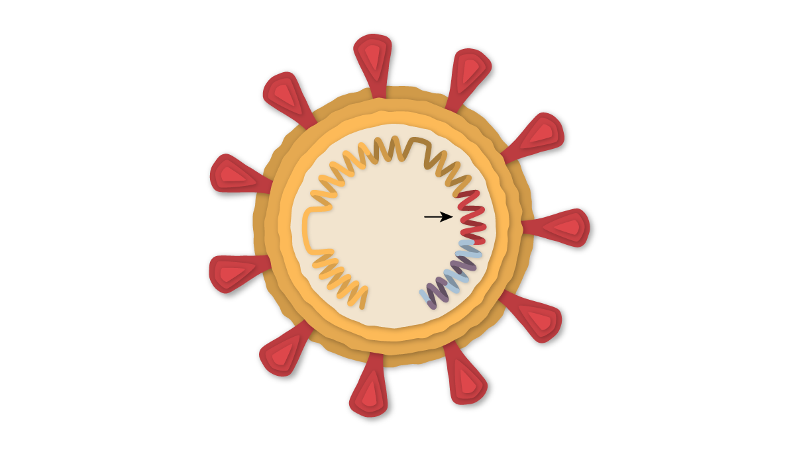
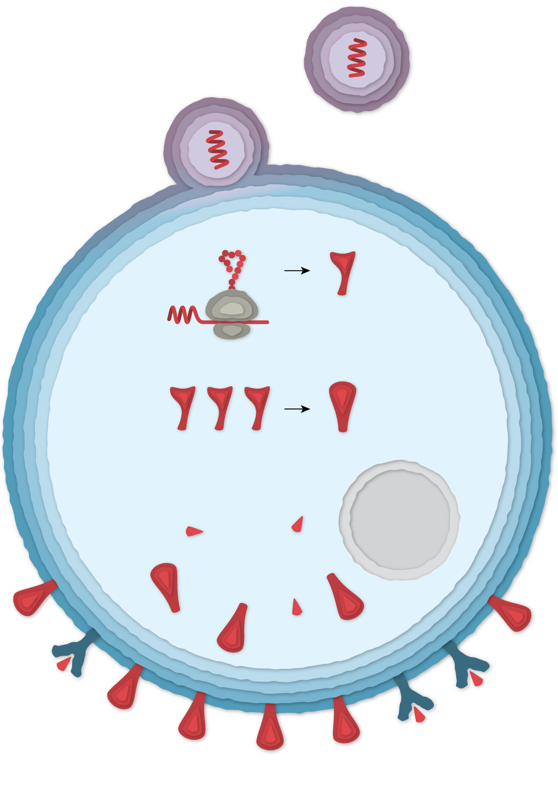
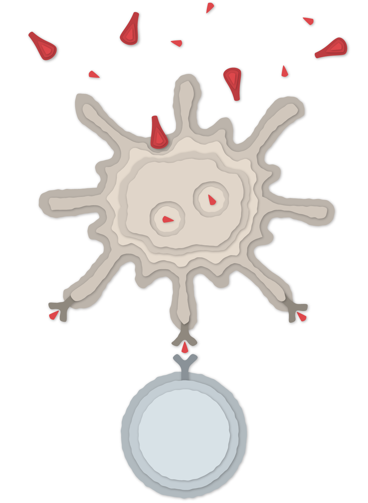
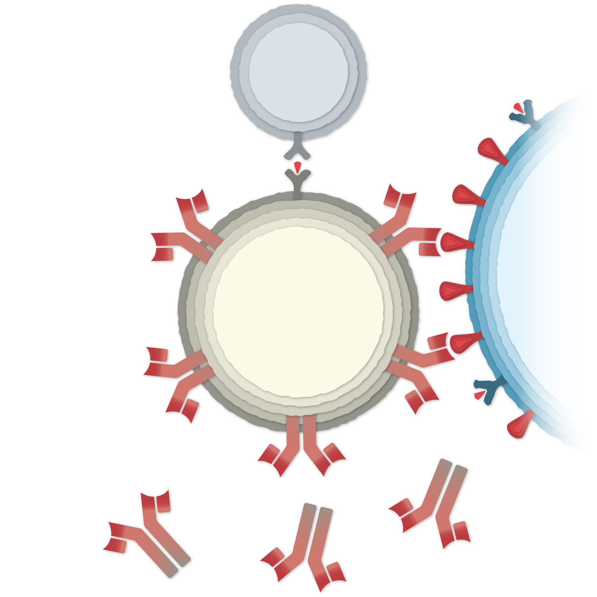
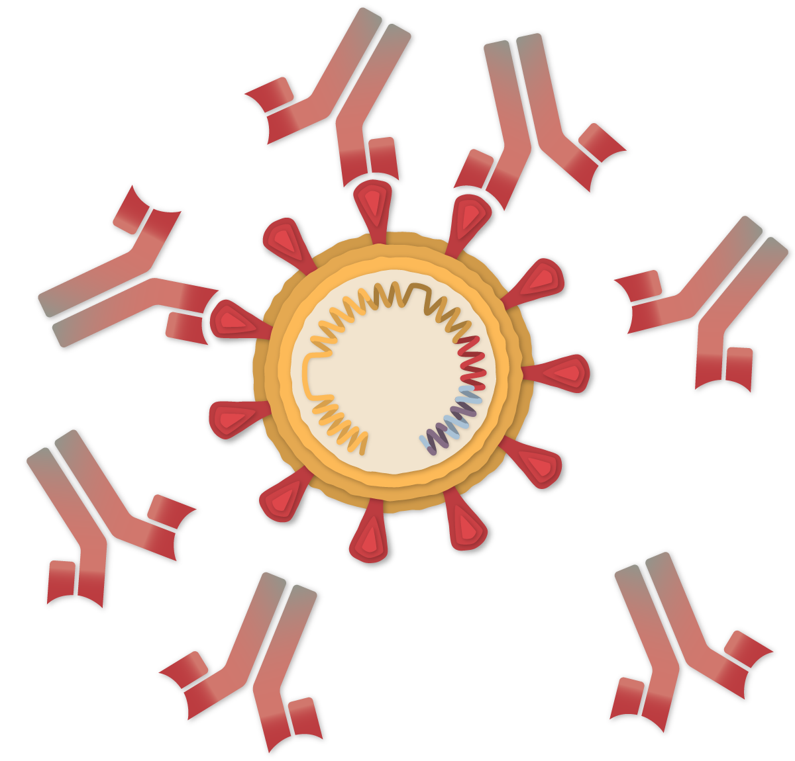
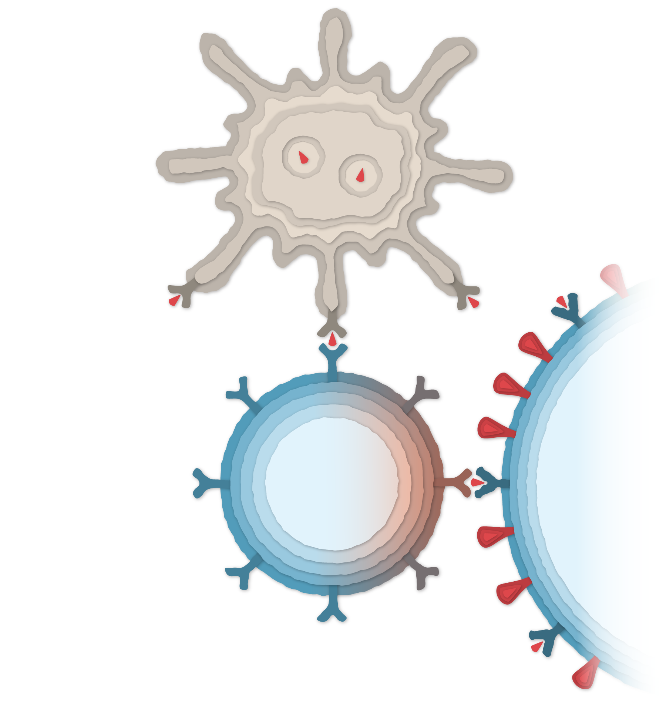
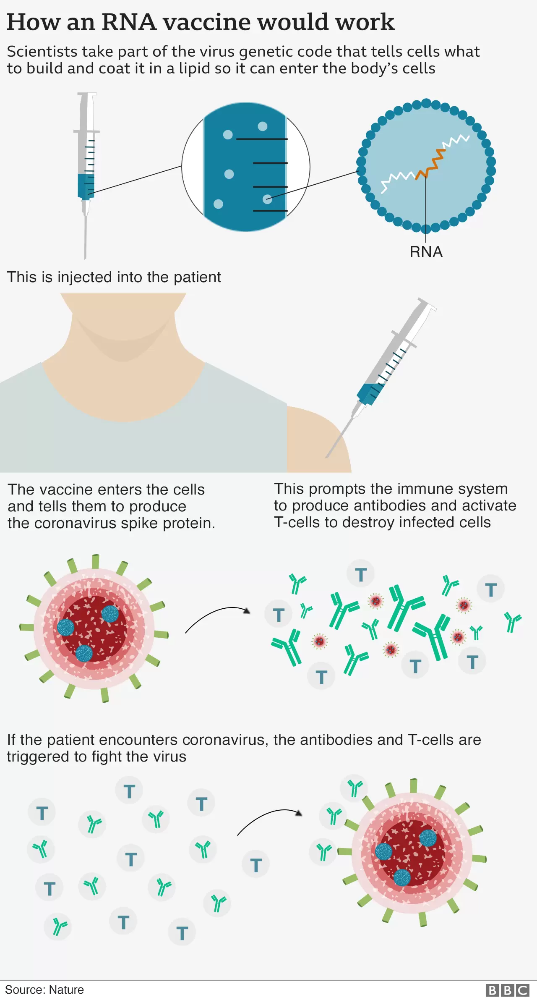


<link href="./assets/styles.css" rel="stylesheet">


There was a time, during the Covid pandemic, when the media were educating their audiences about the nature and the mechanism of action of different vaccines being developed against covid. I remember numerous infographics in the papers; but I did not save them then; and they are hard to locate now. At least my google-fu isn’t strong enough. I managed to find a couple of different ones, which will illustrate my point. [One]([Link](https://www.nytimes.com/interactive/2020/health/pfizer-biontech-covid-19-vaccine.html)) was produced by the _New York Times’_ graphics department; and the [other](https://www.bbc.co.uk/news/world-europe-54902056) was published by the BBC and is attributed to _Nature_.

## The Infographics

### 1. From the New York Times

<figure>

<figcaption>
Figure 1. The coronavirus. The surface of the virus is covered with the spike protein. The arrow shows the spike protein gene.
</figcaption>
</figure>

<figure>

<figcaption>
Figure 2. A lipid nanoparticle containing the mRNA that encodes the spike protein.
</figcaption>
</figure>

<figure>

<figcaption>
Figure 3. Vaccine particles enter the cell. Vaccine mRNA is translated in the cell cytoplasm into the spike protein (three spike subunits combine into a full protein). The spike protein and its fragments are then exposed on the cell surface.
</figcaption>
</figure>

<figure>

<figcaption>
Figure 4. Debris from dead cells is consumed by antigen-presenting cells (top), which present spike protein fragments to helper T cells (bottom).
</figcaption>
</figure>

<figure>

<figcaption>
Figure 5. B cells (center) encounter the spike protein on the surface of vaccinated cells (right) or floating frely in the intercellular fluid; and are activated by helper T cells (top) to produce antibodies.
</figcaption>
</figure>

<figure>

<figcaption>
Figure 6. Antibodies latch onto coronavirus spikes, mark the virus for destruction and prevent infection by blocking the spikes from attaching to other cells.
</figcaption>
</figure>

<figure>

<figcaption>
Figure 7. Killer T cells (center) activated by antigen-presenting cells (top) destroy coronavirus-infected cells that display spike protein fragments on their surface.
</figcaption>
</figure>

### From the BBC

<figure>

</figure>

## What is not shown, and what leaves me confused

The infographics are in perfect correspondence with our understanding of basic immunology. However, here are at least some of the questions that these images are glosisng over.

1. Which cells are going to express the spike protein after the vaccination? The lipid nanoparticles do not have any targeting mechanism, which should mean that they are likely to merge with the membrane of any cell they are going to come in contact with. How can we be sure then that the mRNA will remain only within the site of the injection? Also, does the injection technique matter? Does it matter how close to a vessel a needle might get in a given patient?
2. What happens to the cells that start producing the spike protein? Surely since the spike is a foreign protein, they should be recognised by the immune system and destroyed. How safe is this, especially considering that there is no way of predicting which cells are going to take up the mRNA?
3. If cells that produce the spike protein are hunted down and destroyed by the immune system, how risky is it that this may trigger an autoimmune reaction? Is the myocarditis that has been reported after the vaccination due to an autoimmune reaction, or to the uptake of mRNA-containing lipid nanoparticles by heart cells?
4. Is the spike protein itself that is produced by the transfected cells harmful? There have been suggestions that it is toxic to endothelial cells.
5. How much of the spike protein is the body going to produce after an injection? In contrast to a vaccine that would just deliver a known quantity of the spike protein, an mRNA vaccine delivers a precursor, which will have to be transformed into the protein. How much variability is there in this process?
6. How long does the mRNA remain stable and thus capable of translating into the protein? It has been suggested that the use of pseudouridine for the synthesis of the RNA molecules makes them much more resilient to degradation.
7. How significant it is that the vaccine mRNA has been observed to reverse-transcribe in hepatocytes in vitro? From the biological perspective alone, this should be huge; but how significant is it clinically?
8. What is the nature of the link between vaccination and blood clotting? Is it just a plain generalized inflammatory response increasing the risk of clotting, or is there something more specific (e.g. spike being toxic for endothelial cells)?
