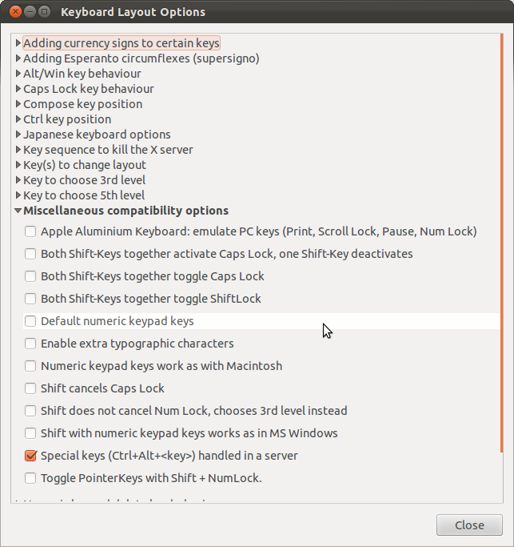
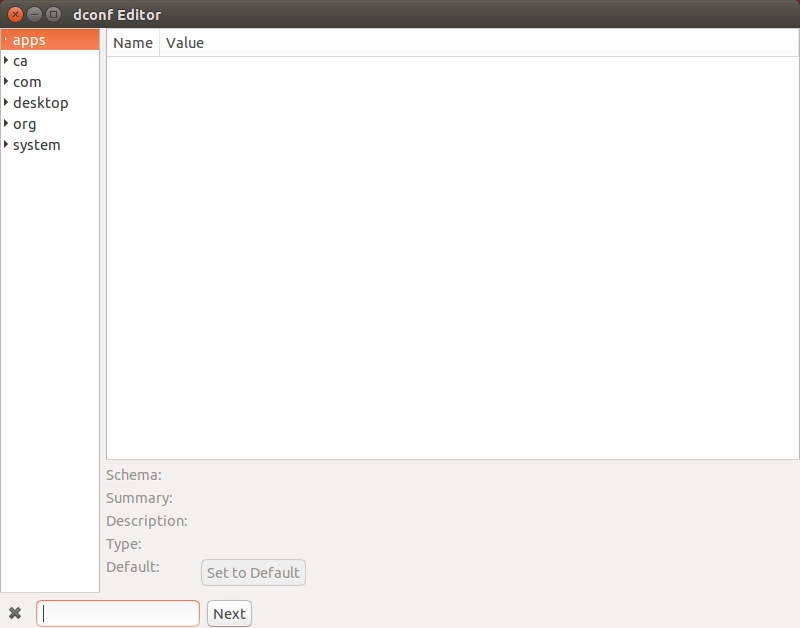
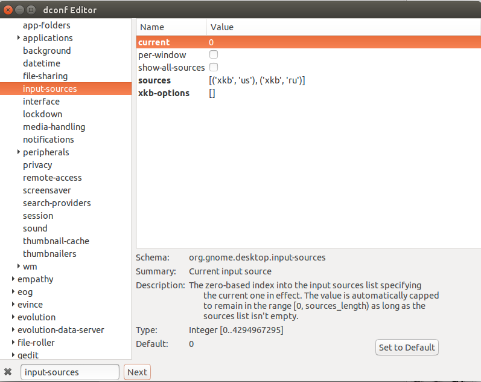
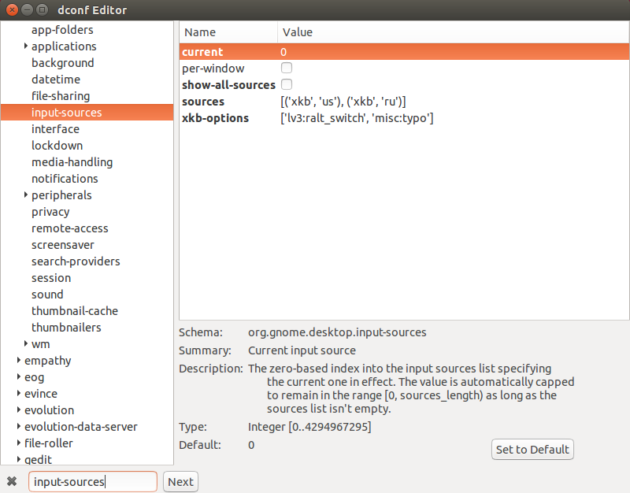

I use Linux as my desktop operating system. And out of the many Linux distros out there I frequently find myself using Ubuntu, despite (or maybe partly because of) their Unity graphical shell. It just feels like the simplest and the best supported Linux distro out there.

But what nearly ended my relationship with Ubuntu was their change of the keyboard layout switcher, which happened between Ubuntu 13.04 and Ubuntu 13.10. At that point, they merged in the new keyboard switcher from upstream, and got rid of the traditional “Keyboard Layout Options” dialog box, which looked like this:



Now, the particular use of this keyboard layout options box in my case was enabling the typographic layout. Having had some experience with book publishing before, I am now a sucker for typographically correct symbols, such as dashes (— or –), curly quotes (“”), curly apostrophe (’), or the quotation marks used in the Russian tradition («» or „“). All this goodness could be enabled on Ubuntu using that keyboard layout options dialog, specifically by choosing a key “to choose 3rd level” (whatever that means; I chose the right Alt for it), and then checking “Enable extra typographic characters” in the Miscellaneous compatibility options section.

Ubuntu’s decision to remove this dialog box meant that I could not enable my beloved extra typographic characters anymore (or so I thought), and that pissed me off to an extent that I switched from Ubuntu with its Unity to distros with KDE environment (first to OpenSuse, then to Linux Mint KDE).

Well, it turns out there is a way to get the extra typographic characters back. And thanks to [Dr.AKULAvich](http://drakulavich.blogspot.ru/2015/02/ubuntu-extra-typographic-characters.html) for pointing out a solution.

So here it is, in pictures.

Firstly, open the terminal and install dconf-editor:

```
sudo apt-get install dconf-editor
```

Then, open dconf-editor (e.g. by typing `dconf-editor` in the terminal). Press Ctrl-F to open a search box, and type `input-sources` in it:





Observe that the parameter `xkb-options` is an empty array. Insert into it the following:

```
'lv3:ralt_switch', 'misc:typo'
```



Close dconf-editor — and that’s it. Now, typographic characters are enabled. Isn’t that sweet?
